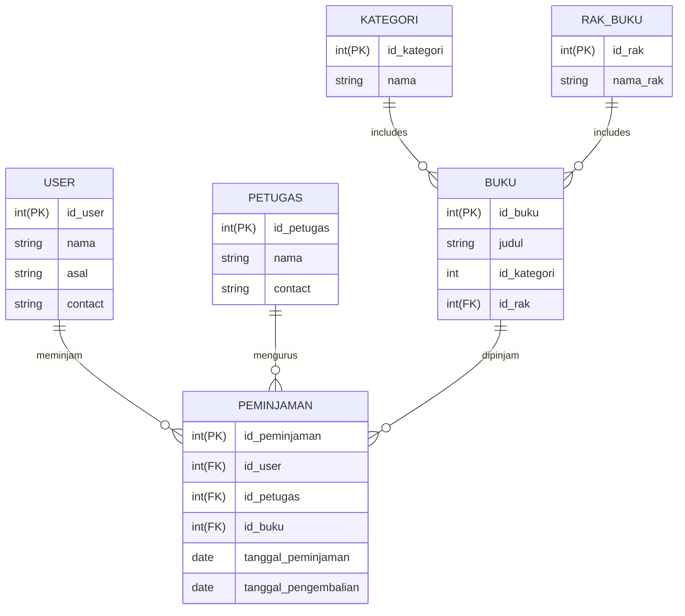

# Database

## Sistem Perpustakaan

```mermaid
erDiagram
    USER ||--o{ PEMINJAMAN : meminjam
    PETUGAS || --o{ PEMINJAMAN : mengurus
    KATEGORI || --o{ BUKU : includes
    RAK_BUKU || --o{ BUKU : includes
    BUKU || --o{ PEMINJAMAN : dipinjam

    USER {
        int(PK) id_user
        string nama
        string asal
        string contact
    }
    BUKU {
        int(PK) id_buku
        string judul
        int id_kategori
        int(FK) id_rak
    }
    KATEGORI{
        int(PK) id_kategori
        string nama
    }
    RAK_BUKU{
        int(PK) id_rak
        string nama_rak
    }
    PETUGAS{
        int(PK) id_petugas
        string nama
        string contact
    }
    PEMINJAMAN{
        int(PK) id_peminjaman
        int(FK) id_user
        int(FK) id_petugas
        int(FK) id_buku
        date tanggal_peminjaman
        date tanggal_pengembalian
    }
```
